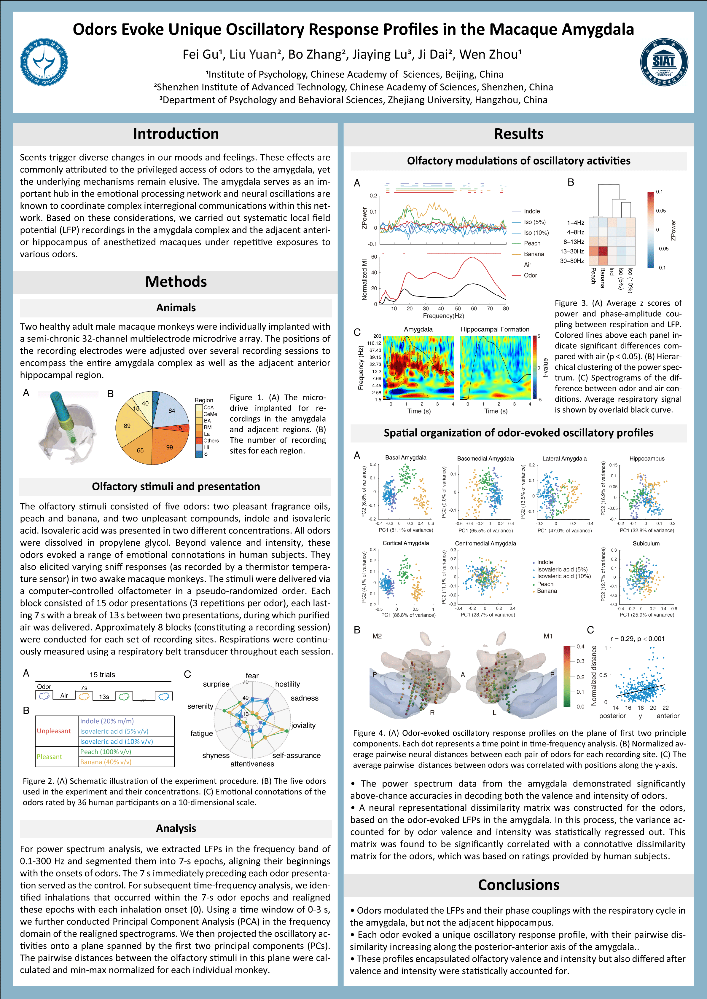

```{r include=FALSE}
knitr::opts_chunk$set(warning = F, message = F, cache = TRUE,tidy=F,fig.align='center',fig.showtext=TRUE,results="hold",fig.show = "hold")
```

# Abstract

Scents trigger diverse changes in our moods and feelings. These effects are commonly ascribed to the privileged access of odors to the amygdala, yet the underlying mechanisms remain elusive. Utilizing a high-resolution multi-electrode array, we conducted systematic local field potential (LFP) recordings in the amygdala complex and anterior hippocampus of anesthetized macaques under repetitive exposures to various odors. We observed significant olfactory modulations of the spectral powers of rhythmic activities and their phase couplings with the respiratory cycle in the amygdala, but not the adjacent hippocampus. Each odor evoked a unique oscillatory response profile, with their pairwise dissimilarity increasing along the posterior-anterior axis of the amygdala. These profiles encapsulated olfactory valence and intensity but also differed between odors even after valence and intensity were statistically accounted for. By spatiotemporally characterizing the oscillatory signatures of odors in the amygdala, our findings provide fresh insight into their unique impacts on emotion.

# Poster

<!--  -->

