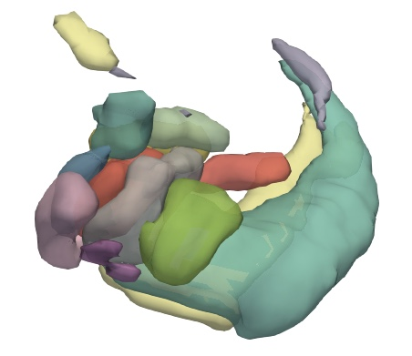

# Introduction
I found 3d visualization is really useful for understanding MRI results. Here is a brief guide which is mainly based on [this paper](https://f1000research.com/articles/4-466/v1).

# Convert nii to VTK
First of all, we should convert nii files to VTK format using [ITK-SNAP](https://www.itksnap.org/).

1. Open a main image (e.g. whole brain mask).
2. Open a segmentation (e.g. ROIs).
3. Export as surface mesh and select labels.
4. Save as "VTK PolyData File". Separate files will be named as "prefix+value".
5. A 3d view will be open in the bottom-left window after saving.

<!--  -->

# Render in 3d
[ParaView](https://www.paraview.org/) is an open source visualization application which could render VTK files as surface in 3d.

1. Open VTK files, and press Apply (Open as a group will generate time series).
2. Show all in the pipeline browser.
3. Select every file and add a `Group Datasets` filter.
4. Change properties.
5. Save state.

<!--  -->

# References
* [ITK-SNAP Documentation](https://www.itksnap.org/pmwiki/pmwiki.php?n=Documentation.SNAP3)
* [ParaView tutorials](https://docs.paraview.org/en/latest/Tutorials/index.html)
* [ParaView video tutorials](https://www.bilibili.com/video/BV1mb4y167mJ)
* [Animating a slice in ParaView](https://cfdengine.com/newsletter/174/)
* [Link properties in ParaView](https://discourse.paraview.org/t/how-to-link-paraview-filter-details-between-views/7020/3)